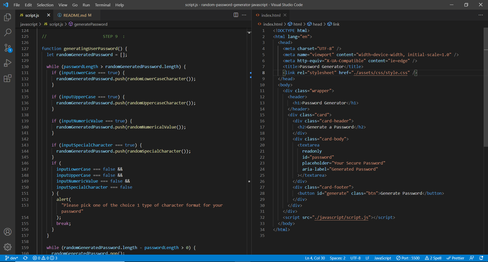
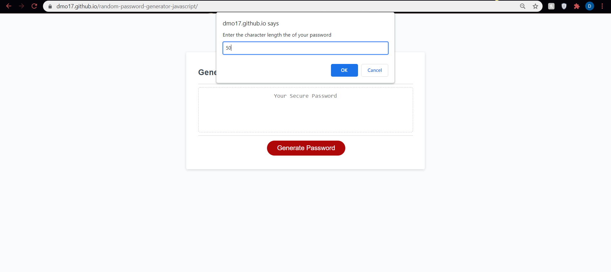
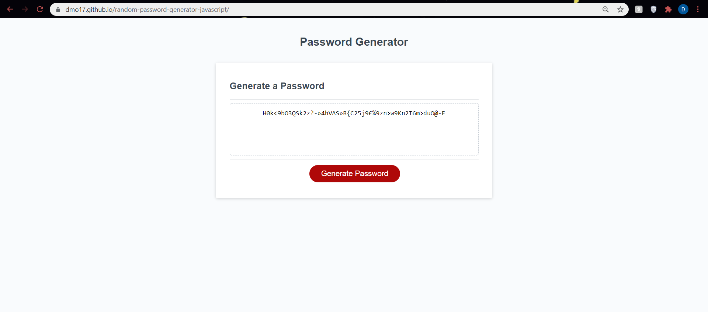

# random-password-generator-javascript

## Description:

A starter code is modified to create a web-application that generates a randomly created password based on a password criteria that the user selects from. The app will run in the browser and feature dynamically updated HTML and CSS powered by JavaScript code

## Completed :

To see the full URL deployed web-application project <a href=https://dmo17.github.io/random-password-generator-javascript/>click here </a>

## Preview: Image Of JavaScript Code:

## Preview Image Of Web-page:

## Portfolio Work completed:

- Added a a series of prompts for password criteria when the button is clicked
- The user inputs the length of the password when prompted that also fits a certain criteria
- The user then can confirm the character types to include in the password whether its lowercase, uppercase, numeric, and/or special characters
- The password generated will match the users selected password criteria
- The password is displayed on the webpage
